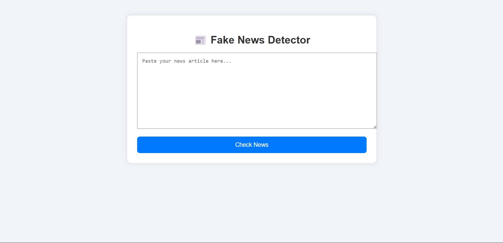
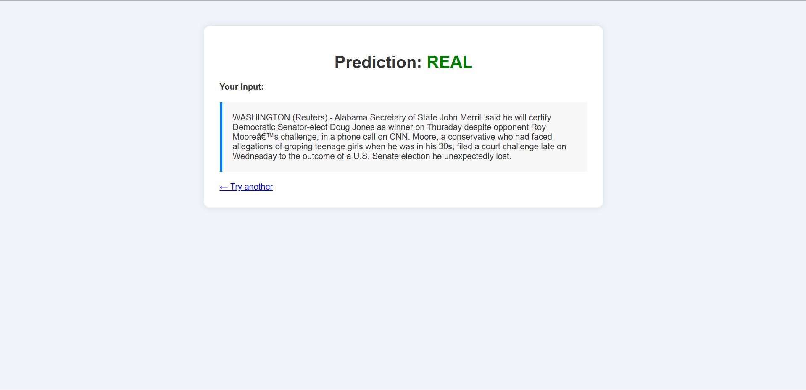

# 📰 Fake News Detector

A full-fledged web application built with Flask and Machine Learning to classify news articles as **Fake** or **Real** using Natural Language Processing.

## 🚀 Features

- 🔍 Predicts whether a news article is fake or real
- 📊 Machine Learning with TF-IDF + PassiveAggressiveClassifier
- 🧠 Trained on a dataset of over 40,000 real and fake news articles
- 🌐 Flask-based web interface
- 🎨 Styled using HTML & CSS for a clean UI
- 📁 Uploads two datasets: `True.csv` and `Fake.csv`

---

## 📦 Dataset

- `True.csv`: News articles from legitimate sources
- `Fake.csv`: Fabricated or misleading news articles

Source: [Kaggle Fake News Dataset](https://www.kaggle.com/clmentbisaillon/fake-and-real-news-dataset)

---

## 🧠 Model Details

- **Vectorizer**: `TfidfVectorizer` (removes stopwords)
- **Model**: `PassiveAggressiveClassifier`
- Trained with ~40,000 articles

---

## 🖥️ UI Screenshots




---

## 🛠 How to Run Locally

```bash
# 1. Clone the repository
git clone https://github.com/Sumeet-01/fake-news-detector.git
cd fake-news-detector

# 2. Install dependencies
pip install -r requirements.txt

# 3. Skip this step if you're just running the app!
python train.py

# 4. Run the app
python app.py
